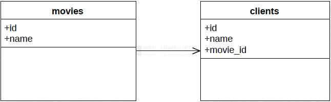

# README

* Desafío - Relaciones 1 a N en los modelos

* Daniel Sotelo A.

    - Modificación Apoyo desafio

    - Se Modifica relaciones iniciales en client.rb y movie.rb
    

    - El proyecto muestra el arriendo de peliculas por cliente

    - Donde el cliente solo puede efectuar un solo arriendo
        - Se utiliza boton Devolver pelicula antes de efectuar nvo. arriendo

    - Y una pelicula (id) no puede ser arrendada por mas de un cliente
        - se utiliza query Movie.left_joins(:clients).where(clients: {movie_id: nil}).order(name: :asc)
        * para no listar peliculas ya arrendadas
    